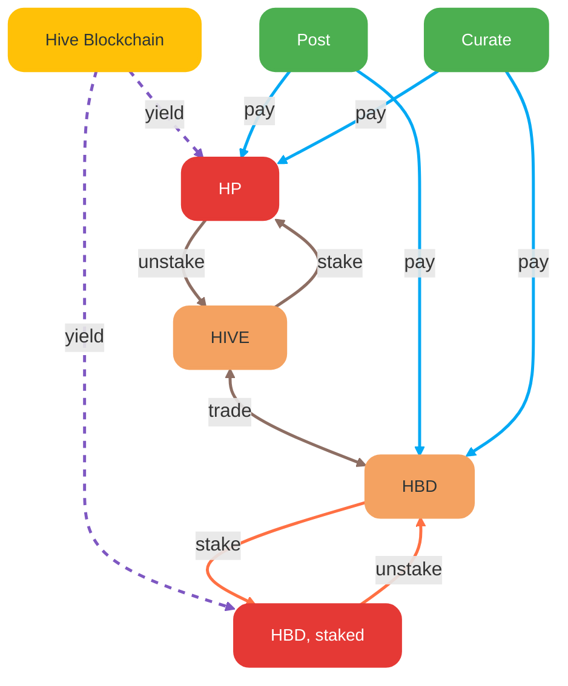

## HIVE Tokenomics Graph

```mermaid
graph TD
%% Define Nodes
Hive_Chain[Hive Blockchain]
Hive_Post[Post]
Hive_Curate[Curate]
HIVE[HIVE]
HBD[HBD]
HIVE_Staked[HP]
HBD_Staked[HBD, staked]


Hive_Chain -->|yield| HIVE_Staked
Hive_Chain -->|yield| HBD_Staked
HIVE <-->|trade| HBD
HIVE -->|stake| HIVE_Staked
HIVE_Staked -->|unstake| HIVE
HBD -->|stake| HBD_Staked
HBD_Staked -->|unstake| HBD
Hive_Post -->|pay| HIVE_Staked
Hive_Post -->|pay| HBD
Hive_Curate -->|pay| HIVE_Staked
Hive_Curate -->|pay| HBD

classDef token fill:#F4A261,stroke:#F4A261,stroke-width:3px,color:#2d3436,rx:12px,ry:12px,font-size:14px
classDef staked fill:#E53935,stroke:#E53935,stroke-width:3px,color:#FFFFFF,rx:12px,ry:12px,font-size:14px
classDef action fill:#4CAF50,stroke:#4CAF50,stroke-width:3px,color:#FFFFFF,rx:12px,ry:12px,font-size:14px
classDef chain fill:#FFC107,stroke:#FFC107,stroke-width:3px,color:#2d3436,rx:12px,ry:12px,font-size:14px

class Hive_Chain chain
class HIVE,HBD token
class HIVE_Staked,HBD_Staked staked
class Hive_Post,Hive_Curate action

linkStyle 0 stroke:#7E57C2,stroke-width:2.5px,stroke-dasharray:6,4
linkStyle 1 stroke:#7E57C2,stroke-width:2.5px,stroke-dasharray:6,4
linkStyle 2 stroke:#8D6E63,stroke-width:2.5px
linkStyle 3 stroke:#8D6E63,stroke-width:2.5px
linkStyle 4 stroke:#8D6E63,stroke-width:2.5px
linkStyle 5 stroke:#FF7043,stroke-width:2.5px
linkStyle 6 stroke:#FF7043,stroke-width:2.5px
linkStyle 7 stroke:#03A9F4,stroke-width:2.5px
linkStyle 8 stroke:#03A9F4,stroke-width:2.5px
linkStyle 9 stroke:#03A9F4,stroke-width:2.5px
linkStyle 10 stroke:#03A9F4,stroke-width:2.5px
```

## Hive Blockchain History