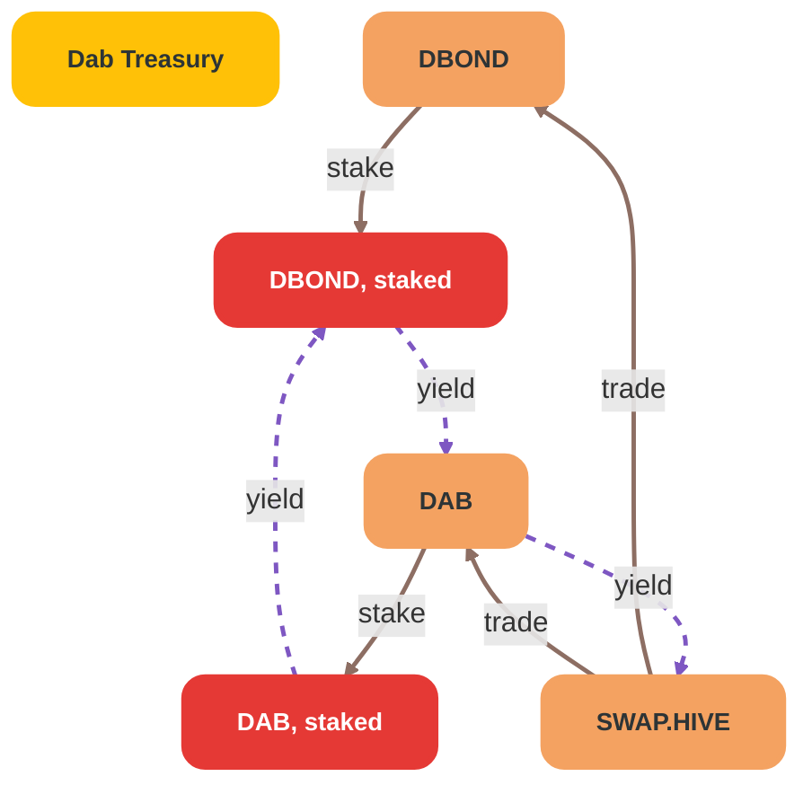

## Dab Treasury Token Graph

```mermaid
graph TD

  

%% Define Nodes

Dab_Project[Dab Treasury]

DBOND[DBOND]

DBOND_Staked[DBOND, staked]

DAB[DAB]

DAB_Staked[DAB, staked]

SWAPHIVE[SWAP.HIVE]

  

%% Relationships

SWAPHIVE -->|trade| DBOND

SWAPHIVE -->|trade| DAB

DBOND -->|stake| DBOND_Staked

DBOND_Staked -->|yield| DAB

DAB -->|stake| DAB_Staked

DAB -->|yield| SWAPHIVE

DAB_Staked -->|yield| DBOND_Staked

  

%% Styling Nodes

classDef token fill:#F4A261,stroke:#F4A261,stroke-width:3px,color:#2d3436,rx:12px,ry:12px,font-size:14px

classDef staked fill:#E53935,stroke:#E53935,stroke-width:3px,color:#FFFFFF,rx:12px,ry:12px,font-size:14px

classDef chain fill:#FFC107,stroke:#FFC107,stroke-width:3px,color:#2d3436,rx:12px,ry:12px,font-size:14px

  

class DBOND,DAB,SWAPHIVE token

class DBOND_Staked,DAB_Staked staked

class Dab_Project chain

  

%% Styling Links

linkStyle 0 stroke:#8D6E63,stroke-width:2.5px

linkStyle 1 stroke:#8D6E63,stroke-width:2.5px

linkStyle 2 stroke:#8D6E63,stroke-width:2.5px

linkStyle 3 stroke:#7E57C2,stroke-width:2.5px,stroke-dasharray:6,4

linkStyle 4 stroke:#8D6E63,stroke-width:2.5px

linkStyle 5 stroke:#7E57C2,stroke-width:2.5px,stroke-dasharray:6,4

linkStyle 6 stroke:#7E57C2,stroke-width:2.5px,stroke-dasharray:6,4

  

%% Node Font Styling

classDef fontSettings font-family:Arial, Helvetica, sans-serif,font-weight:bold

class Dab_Project,DBOND,DAB,SWAPHIVE,DBOND_Staked,DAB_Staked fontSettings
```