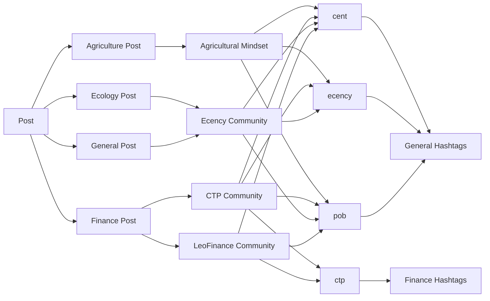

### Hashtag Graph

```mermaid
graph LR

  

%% Define Nodes

Post[Post]

AgricultureP[Agriculture Post]

EcologyP[Ecology Post]

FinanceP[Finance Post]

GeneralP[General Post]

  

FinanceH[Finance Hashtags]

GeneralH[General Hashtags]

  

cent[cent]

ctp[ctp]

ecency[ecency]

pob[pob]

  

AgriculturalMindset[Agricultural Mindset]

CTP[CTP Community]

Ecency[Ecency Community]

LeoFinance[LeoFinance Community]

  

%% Relationships

Post --> AgricultureP

Post --> EcologyP

Post --> FinanceP

Post --> GeneralP

  

AgricultureP --> AgriculturalMindset

EcologyP --> Ecency

FinanceP --> LeoFinance

FinanceP --> CTP

GeneralP --> Ecency

  

AgriculturalMindset --> cent

AgriculturalMindset --> ecency

AgriculturalMindset --> pob

  

CTP --> ctp

CTP --> cent

CTP --> ecency

CTP --> pob

  

Ecency --> cent

Ecency --> ecency

Ecency --> pob

  

LeoFinance --> ctp

LeoFinance --> cent

LeoFinance --> pob

  

cent --> GeneralH

ctp --> FinanceH

ecency --> GeneralH

pob --> GeneralH
```